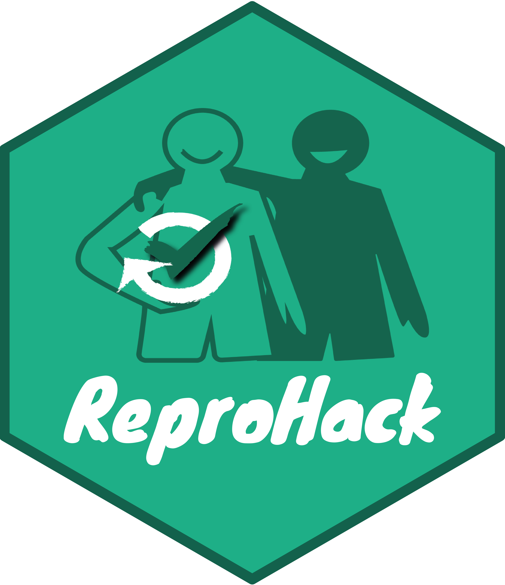

# ReproHack HQ 
Welcome to the ReproHack Headquarters! :tada:  

 

***

 

## What is a ReproHack
### A one day, hands-on Reproducibility Hackathon

We are all excited by the progress made by many authors to **make their papers reproducible by publishing associated code and data**. 

We know how challenging it can be so we **want to showcase the value of the practice**, both for original authors and as a learning experience for those who attempt to reproduce the work. 

## **Event format**:

During a ReproHack, **participants attempt to reproduce published research of their choice from a list of proposed papers with publicly available associated code and data**. 

Participants get to work with other people's material in a low pressure environment and record their experiences on a number of key aspects, including reproducibility, transparency and reusability of materials. At the end of the day we regroup, share our experiences and give feedback to the authors.

It's imperative to note that  **ReproHacks are by no means an attempt to criticise or discredit work**. We see reproduction as **beneficial scientific activity in itself**, with useful outcomes for authors and valuable learning experiences for the participants and the research community as a whole.

## **Ways to participate**

 

### :page_facing_up: **Propose a paper**

##### You've put a lot of effort into making your work reproducible. Now let people learn from and engage with it! 

Benefits to authors:

- **Feedback** on the reproducibility of your work.

- **Appreciation** for your efforts in making your work reproducible.

- Opportunity to **engage others with your research**.

 

### :arrows_counterclockwise: :white_check_mark: **Reproduce**

##### Join us at the ReproHack and get working with other people's material.

Benefits to participants:

- **Practical experience in reproducibility** with real published materials and the opportunity to explore different tools and strategies.

- **Inspiration** from working with other people’s code and data.

- An appreciation that **reproducibility is non trivial** but that opening up your work for more people to engage with is the best way to help improve it.

- An appreciation that **reproducibility has community value beyond just the validation of the results**. For example,  access to such materials increases the potential for reuse and understanding of the work.

**Benefits to the whole research community:**

- Assessment of how reproducible papers are ‘out of the box’.

- Evaluation of how successful current practices are and for what purpose.

- Identification of what works and where the most pressing weaknesses in our approaches are.

***

## Many ways to ReproHack!

***

## Contributing

### Run a ReproHack!

Please get in touch if you would like to run a ReproHack. We are working to make materials more reusable and easier to reproduce and also on developing guidance on organising and running an event so that in future folks will be able to run everything independently.
There are currently [reusable materials](https://github.com/reprohack/reprohack-template-shiny) and [instructions for organisers](organiser_instructions.md). However, there are plans to streamline the materials & workflow. At this stage, we also really appreciate contact with organisers in order to both help and to learn from their experiences.

### Hack the ReproHack!

There are a [number of topics](dev_directions.md) we are working on to improve the events and make them reproducible and scalable. Details on the main development directions can be found in the on the 

See [Roadmap]() for more details on milestones

***

## Chat to us

## Team

- [Anna Krystalli](https://github.com/annakrystalli)
- [Florencia D'Andrea](https://github.com/flor14)
