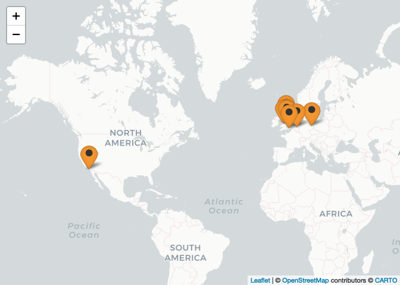

ReproHack HQ
================

<!-- README.md is generated from README.Rmd. Please edit that file -->

Welcome to the ReproHack Headquarters\! :tada:

<!-- badges: start -->

<!-- badges: end -->

-----

 

> ## :tada:  NEW HUB CONSTRUCTION COMPLETE\! :tada:
> 
> OUR NEW SITE IS NOW READY!
> 
> ## Find us at [reprohack.org](http://reprohack.org) 

-----

## What is a ReproHack

### A one day, hands-on Reproducibility Hackathon

We are all excited by the progress made by many authors to **make their
papers reproducible by publishing associated code and data**.

We know how challenging it can be so we **want to showcase the value of
the practice**, both for original authors and as a learning experience
for those who attempt to reproduce the work.

## **Event format**:

During a ReproHack, **participants attempt to reproduce published
research of their choice from a list of proposed papers with publicly
available associated code and data**.

Participants get to work with other people’s material in a low pressure
environment and record their experiences on a number of key aspects,
including reproducibility, transparency and reusability of materials. At
the end of the day we regroup, share our experiences and give feedback
to the authors.

It’s imperative to note that **ReproHacks are by no means an attempt to
criticise or discredit work**. We see reproduction as **beneficial
scientific activity in itself**, with useful outcomes for authors and
valuable learning experiences for the participants and the research
community as a
whole.

## **Ways to participate**

 

### :page\_facing\_up: **Propose a paper**

##### You’ve put a lot of effort into making your work reproducible. Now let people learn from and engage with it\!

Benefits to authors:

  - **Feedback** on the reproducibility of your work.

  - **Appreciation** for your efforts in making your work reproducible.

  - Opportunity to **engage others with your
research**.

 

### :arrows\_counterclockwise: :white\_check\_mark: **Reproduce**

##### Join us at the ReproHack and get working with other people’s material.

Benefits to participants:

  - **Practical experience in reproducibility** with real published
    materials and the opportunity to explore different tools and
    strategies.

  - **Inspiration** from working with other people’s code and data.

  - An appreciation that **reproducibility is non trivial** but that
    opening up your work for more people to engage with is the best way
    to help improve it.

  - An appreciation that **reproducibility has community value beyond
    just the validation of the results**. For example, access to such
    materials increases the potential for reuse and understanding of the
    work.

**Benefits to the whole research community:**

  - Assessment of how reproducible papers are ‘out of the box’.

  - Evaluation of how successful current practices are and for what
    purpose.

  - Identification of what works and where the most pressing weaknesses
    in our approaches are.

-----

## Contributing

### Run a ReproHack\!

Please get in touch if you would like to run a ReproHack. We are working
to make materials more reusable and easier to reproduce and also on
developing guidance on organising and running an event so that in future
folks will be able to run everything independently. There are currently
[reusable
materials](https://github.com/reprohack/reprohack-template-shiny) and
[instructions for organisers](organiser_instructions.md). However, there
are plans to streamline the materials & workflow. At this stage, we also
really appreciate contact with organisers in order to both help and to
learn from their experiences.

### Hack the ReproHack\!

There are a [number of topics](dev_directions.md) we are working on to
improve the events and make them reproducible and scalable. Details on
the main development directions can be found in the on the

See [Roadmap]() for more details on milestones

 

-----

# Upcoming Reprohacks

| title | date | start\_time | end\_time | city | country |
| :---- | :--- | :---------- | :-------- | :--- | :------ |

## Past Reprohacks

| title                                                                                                                       | date       | start\_time | end\_time | city        | country     |
| :-------------------------------------------------------------------------------------------------------------------------- | :--------- | :---------- | :-------- | :---------- | :---------- |
| [ReproHack @ OpenCon Berlin](https://github.com/annakrystalli/OpenConBerlin_ReproHack)                                      | 2016-11-24 | 13:00:00    | 18:00:00  | Berlin      | Germany     |
| [ReproHack @ OpenCon London](https://github.com/OpenCon-London/OpenCon_London-Doathon/blob/master/README.md)                | 2017-11-21 | 09:00:00    | 17:00:00  | London      | UK          |
| [ReproHack @ CarpentryConnect Mcr](https://sheffield-university.shinyapps.io/ReproHack_CCMcr/)                              | 2019-06-27 | 09:30:00    | 15:30:00  | Manchester  | UK          |
| [ReproHack NL](https://www.eventbrite.co.uk/e/reprohack-nl-tickets-73258469053?aff=erelexpmlt)                              | 2019-11-30 | 10:00:00    | 17:00:00  | Leiden      | Netherlands |
| [Reprohack @ PyData LA](https://njnm.shinyapps.io/ReproHack_PDLA19/)                                                        | 2019-12-03 | 12:30:00    | 17:30:00  | Los Angeles | USA         |
| [N8 CIR ReproHack Newcastle](https://www.eventbrite.co.uk/e/n8-cir-reprohack-newcastle-university-tickets-83584660971)      | 2020-01-21 | 10:00:00    | 17:00:00  | Newcastle   | UK          |
| [N8 CIR ReproHack Leeds](https://www.eventbrite.co.uk/e/n8-cir-reprohack-university-of-leeds-tickets-83582961889)           | 2020-02-11 | 10:00:00    | 17:00:00  | Leeds       | UK          |
| [N8 CIR ReproHack Liverpool](https://www.eventbrite.co.uk/e/n8-cir-reprohack-university-of-liverpool-tickets-83584650941)   | 2020-02-25 | 10:00:00    | 17:00:00  | Liverpool   | UK          |
| [N8 CIR ReproHack Sheffield](https://www.eventbrite.co.uk/e/n8-cir-reprohack-university-of-sheffield-tickets-83581940835)   | 2020-03-10 | 10:00:00    | 17:00:00  | Sheffield   | UK          |
| [N8 CIR ReproHack Manchester](https://www.eventbrite.co.uk/e/n8-cir-reprohack-university-of-manchester-tickets-83583756265) | 2020-03-12 | 10:00:00    | 17:00:00  | Manchester  | UK          |

## Map of Reprohacks

<!-- -->

-----

## More on the ReproHack:

  - **Blogpost**: [ReproHacking at Opencon London 2017
    Doathon](https://rse.shef.ac.uk/blog/opencon-london/)
  - **Blogpost**: [Reprohacking at CarpentryConnect
    Manchester 2019](https://software.ac.uk/blog/2019-08-07-reprohacking-carpentryconnect-manchester-2019)
  - **Comunity Call**: Section on ReproHack on [Reproducible Research
    with R, rOpenSci Community Call](https://vimeo.com/351259131)
  - **Blogpost**: [Reproducibility Hackathon Netherlands – the
    aftermath](https://www.software.ac.uk/blog/2020-01-15-reproducibility-hackathon-netherlands-aftermath)
  - **Blogpost**: [N8 CIR ReproHack Northern Tour -
    Winter 2020](https://n8cir.org.uk/news/reprohacks/)

## Many ways to ReproHack\!

-----

 

### Subscribe to our Newsletter

## Team

  - [Florencia D’Andrea](https://github.com/flor14)
  - [Daniela Gawehns](https://github.com/DanielaGawehns)
  - [Anna Krystalli](https://github.com/annakrystalli)
  - [Linda Nab](https://github.com/LindaNab)
  - [Ricarda Proppert](https://github.com/RicardaP)
  - [Paloma Rojas Saunero](https://github.com/palolili23)
