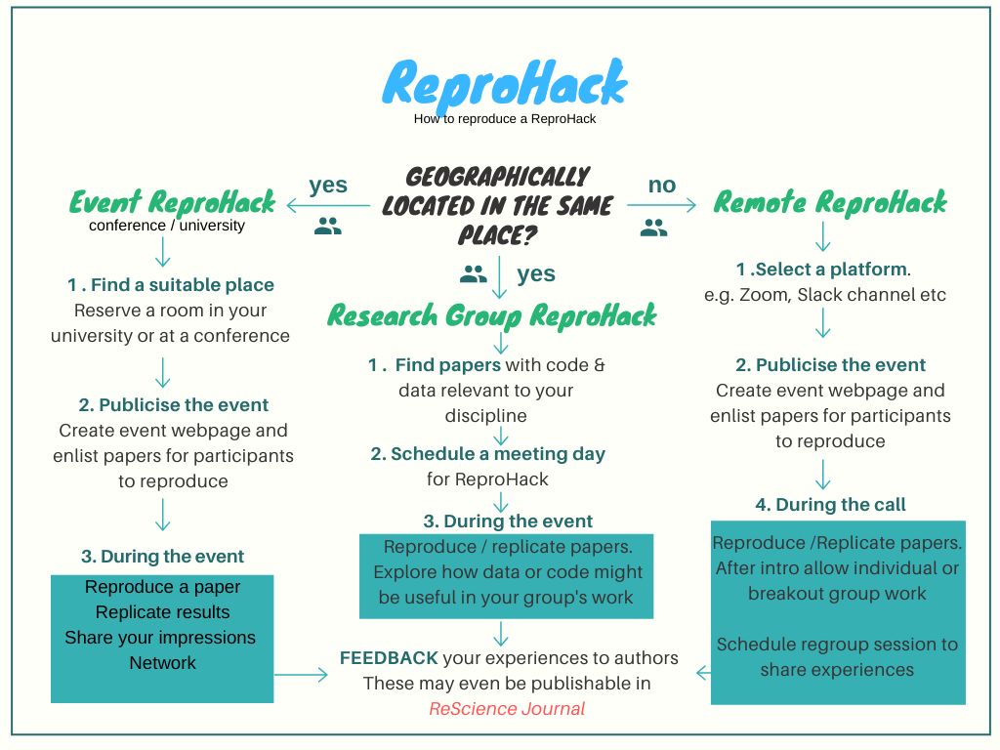
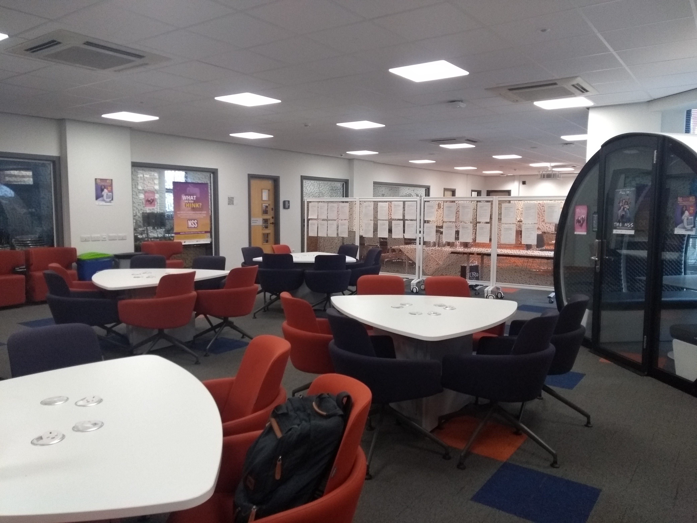
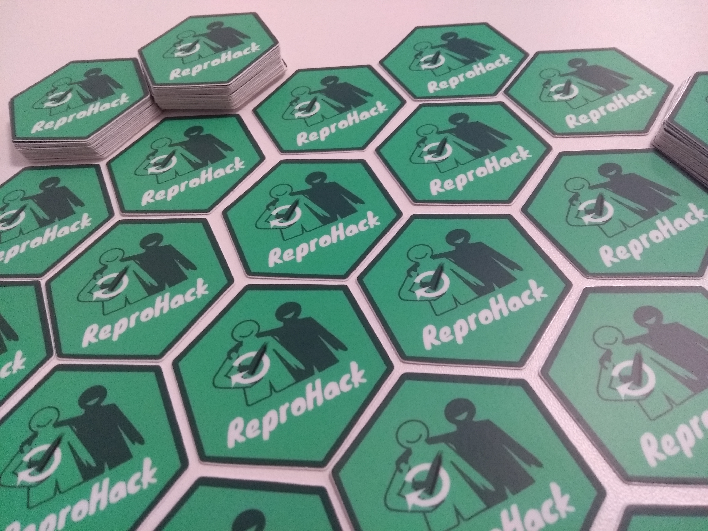

### There are different types of reproHacks

```{r reprohack, echo=FALSE, fig.align='center', out.width="60%"}

```

### Do you want to run a reproHack?

First check our [code of conduct](https://github.com/reprohack/reprohack-hq/blob/master/CODE_OF_CONDUCT.md) You must care for a friendly atmosphere for everyone

Join our [Slack]()! we can give you support during the process of organising your own reproHack

## 1. Pre-Event

### Some weeks in advance
#### Find a location for the event
You will need to find a place with facilities for plug in the laptops of the attendees

#### Publicite the event
You can use our twitter account including `@reproHack`

* Submission Form

The most important preparation to run a Reprohack is to collate a paper list for participants to choose from. Inviting contributions from authors requires a form through which they can submit details of their papers and a web page to present the paper list. A way of collecting and communicating particpant feedback to authors is also required.

We have a [Paper submission form](https://docs.google.com/forms/d/e/1FAIpQLSeNuSAQCHa9spdUh3iYfONLms4Qlg1r6iECZMCXaS_l1m79bw/viewform) for authors to want to submit their papers to be reproduced during the reproHack


#### Good practices
Send an email - message remembering people who want to attend the reprohack hour and location some days in advance

```{r room, echo=FALSE, fig.align='center', out.width="50%"}

```

### Day of the Event
#### Paper posting
<span style="color:#06bf44"> **We paste relevant information about each paper on a wall or frieze to make it easier for participants to choose which paper they want to reproduce.**</span> These printings have information that the authors send in the submission form that includes for example the programming languages used in that paper.
 If the paper has already been reproduced at least once, a reproducibility score is included that can help participants understand the reproducibility of the paper.
This generates a moment of conversation among those who attend.

```{r posting, echo=FALSE, fig.align='center', out.width="50%"}
knitr::include_graphics("posting.jpg")
```

#### Preparing the snacks

Picture?


#### Sponsors

I you got any sponsor for the reproHack it is a good practise to tweet about them during the event or make available its material.


#### Stickers

People really like stickers! If you have the opportunity, [here]() is the one of reproHack ready to be printed for your event!

```{r sticker, echo=FALSE, fig.align='center', out.width="50%"}

```

## 2. Event

### Introductions and Slides
Welcome the people.
<span style="color:#06bf44"> **It is a good idea to encourage attendees to form mixed groups to reproduce the papers.**</span> We suggest groups of two persons, but this is up to the personal choice of the participants

Here some template slides: [Slides]()

### Helpers
<span style="color:#06bf44"> **If it is staff people available, it is a good idea to ask the participants if they need some help during the process.**</span> No technical skills are needed for this, it is just to keep the hackathon going. Remember that ideally, a paper should be reproducible for anyone who wants to have access to that information. If any participant has fewer skills about the research topic of the paper and this became a problem for reproducibility or lack of experience with tools as docker, that is also relevant information to the authors that could be included in the feedback form.

### Breaks
<span style="color:#06bf44"> **Reprohacks promotes a relaxed atmosphere, so we suggest leaving food and beverages free during the event.**</span> No breaks are needed with exception of lunch.

### Let’s share our impressions about reproducibility
<span style="color:#06bf44"> **Sharing opinions about the papers being reproduced could lead to good sharing and interesting discussions.**</span> Before lunch and as final activity could be good moments for this.

### Feedback Form
<span style="color:#06bf44"> **It is important that the participants fill the feedback form** </span> to the authors after they finish their (successful or not) attempt to reproduce the paper.

[Author feedback form](https://docs.google.com/forms/d/e/1FAIpQLSembkNEg3qN0SKxmf6cR4z2Cla47pOhfZ9GCKh5J9KUi1wpcw/viewform)


### End of the event
We encourage to get feedback of the participants.

* What do they like? 
* Which suggerences do they have to improve reproHacking?

You can use post its as an easy way to get the information from the participants.


