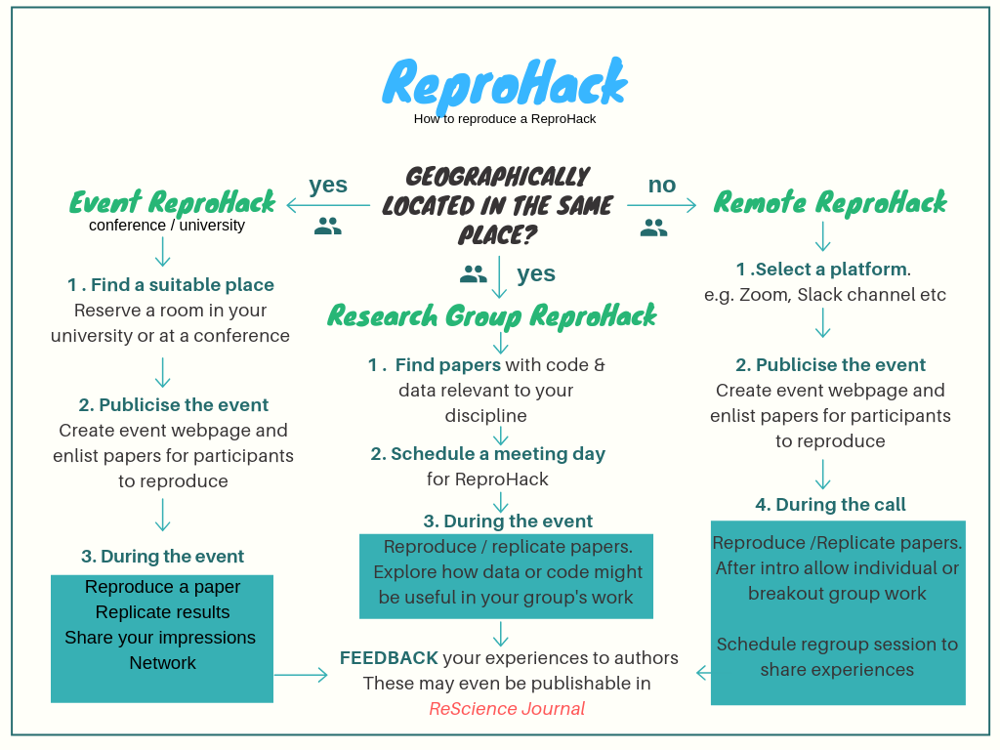

# Organiser Instructions

***

<br>

> ## :construction: NEW HUB UNDER CONSTRUCTION! :construction:
>
>  _We are building a custom website to facilitate ReproHack activities going forwards. It is still very much under construction and buggy but hoping to have it functional by early next year. In the meantime you can continue to use the current materials_ 

> 
> _You can [check it out](http://annakrystalli.pythonanywhere.com/) or if you have Django skills [contribute](https://github.com/reprohack/reprohack_site)!_

### 1. What kind of Reprohack would you like to host?

There are multiple ways to organize a Reprohack, depending on who is your target audience.

- [ ] Check the following flowchart:



- [ ] Choose your Reprohack Flavor! (Choose from [this page]())

### 2. What preparations are necesary before the event?

- [ ] Create the event, you can use Eventbrite or a similar platform for broader audience. 

- [ ] Collate a paper list for participants to choose from.
  + Currently we have this [paper submission form](https://drive.google.com/open?id=1-Q-dQQu47ytCg2Z7F99hzCSxewLCbPUi8UlZWg0JYjI) available. 
  + Make a list of the papers to reprohack for the event day.
  
- [ ] Make a repo for the event. We have built a [**`reprohack-template-shiny`**](https://github.com/reprohack/reprohack-template-shiny) that can be used to create an event. More details below.

- [ ] Set an [author feedback form](https://drive.google.com/open?id=1KRooOAtbmOzIES1h2T9Gvt7AaPFLDS0BQUZRiimJZSU) where participants can fill details on their experience reproducing a specific paper.
  
### 3. For the event.

- [ ] You can use these [introductory slides]() as a template for welcoming all participants.

- [ ] Create a hackpad (eg etherpad, hack.md, googledoc) for collaborative notetaking at the event (optional)
    + you can use this [hackmd.io template](https://hackmd.io/@annakrystalli/reprohack-hackpad-tmpl) if you wish
    
- [ ] Share the [author feedback form](https://drive.google.com/open?id=1KRooOAtbmOzIES1h2T9Gvt7AaPFLDS0BQUZRiimJZSU) where participants can fill details on their experience reproducing a specific paper.

### 4. After the event.

- [ ] Share the feedback to authors who contributed with their papers!

 + To do this we have created an `r pagedown script` that imports the data from the author feedback form, creates a letter to the author containing all feedback, and it can be shared via email using the `blastula` package.
 
 + Check [here]() for the script.
 

## Shiny App

  + This shiny app uses a combination of `Rmarkdown`, `shiny` and googledocs to compile the list of papers and collect feedback for the authors. It also uses a repository on `GitHub` to run the event on the day. This approach comes with limitations:

    + Requirement to authenticate with googledocs
    + Requirement to have a shinyapps.io account or access to a shiny server/institutional shinyapps.io account. Although it is easy to set up a shinyapps.io account, there is a cap on the amount of traffic to the app allowed in the free account and upgrading the subscription to run an event might be required. It is also slow to load.


[**Example of the Shiny app for: UCL ReproHack - Open Access week**](https://sheffield-university.shinyapps.io/ucl-oa_week-reprohack/)

#### Instructions to use the Shinny app

To make use of the current materials and templates to organise a ReproHack, please follow this organiser template. Feel free to reach out if anything is unclear. The workflow is easiest through [Rstudio](https://www.rstudio.com/)

- [ ] Copy template repository [**`reprohack-template-shiny`**](https://github.com/reprohack/reprohack-template-shiny). Name the repository: `reprohack-<location>-YYYY-MM-DD`.
- [ ] Make copies of the two googleforms, one for collecting paper submissions and one for collecting feedback
    + [paper submission form](https://drive.google.com/open?id=1-Q-dQQu47ytCg2Z7F99hzCSxewLCbPUi8UlZWg0JYjI)
    + [author feedback form](https://drive.google.com/open?id=1KRooOAtbmOzIES1h2T9Gvt7AaPFLDS0BQUZRiimJZSU)
- [ ] Get geographical coordinates for venue (e. g. using [latlong.net](https://www.latlong.net/)). 
- [ ] Complete parameters in YAML header of `index.Rmd` & `README.Rmd`. 
    - [ ] Knit `README.Rmd` and push to GitHub.
    - [ ] [Deploy](https://bookdown.org/yihui/rmarkdown/shiny-deploy.html) `index.Rmd` on shinyapps.io. (More on [getting started with shinyapps.io](https://shiny.rstudio.com/articles/shinyapps.html)). Running the document also prompts you to authenticate with google which produces an `.httr-oauth` authorisation token. You will need to deploy:
      - `index.Rmd` and 
      - `.httr-oauth` (required to access the paper list on googlesheets)
      - `reprohack-css` 
      - any other assets used eg if an event banner is being used.
      You can also deploy programmatically with the following example code:
      ```r 
      rsconnect::deployApp(appName = "ReproHack_CCMcr",
                     appTitle = "ReproHack Carpentry Connect Manchester",
                     account = "annakrystalli", appFiles = c("index.Rmd", ".httr-oauth", "reprohack.css",
                                                                    "CCmcrlogo.png"))
      ```
- [ ] Edit and upload `slides.md` containing the introductory to [hackmd.io](https://hackmd.io/) and [set to slide view](https://hackmd.io/s/features#Import-Notes).
    - [ ] update slides url in the `README.md` agenda

### You now have all the materials to run a ReproHack setup! 🎉

<br>

**Got suggestions on improving the materials/workflow? Have a look at [our plans so far](https://github.com/reprohack/reprohack-template-shiny/issues) and feel free to contribute your feedback!**
